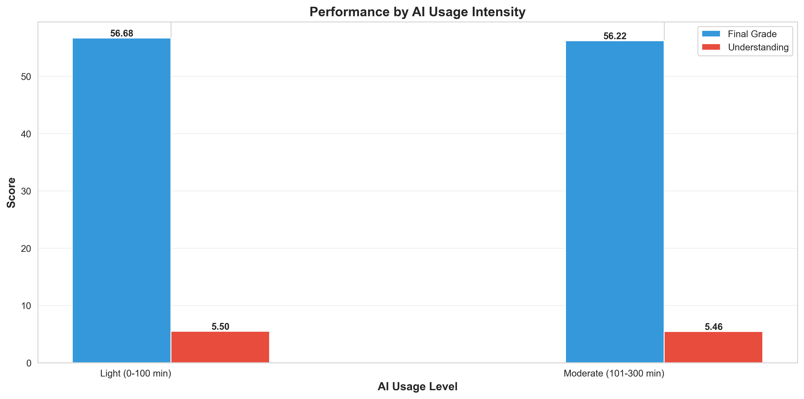
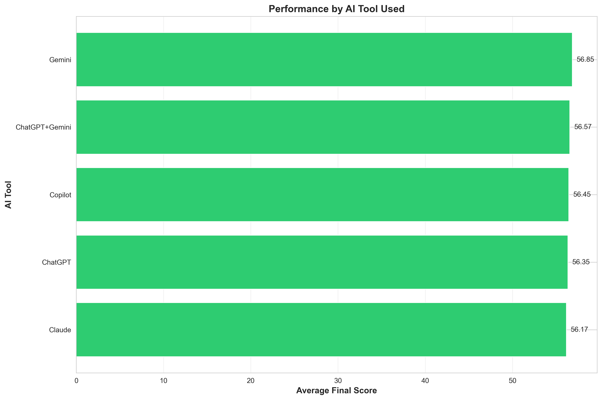
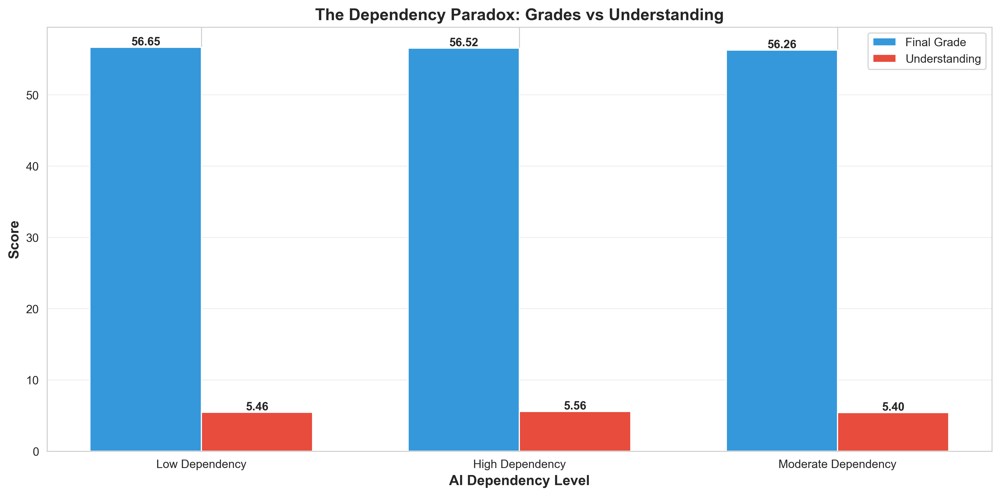

# The Impact of AI Tools on Student Academic Performance

A comprehensive SQL + Python analysis examining how AI tool usage affects university student performance.



---

## Project Overview

**Research Question:** Does AI tool usage improve student academic performance?

**Key Finding:** Light AI usage (<100 min/day) yields optimal results—quality over quantity matters.

- **Dataset:** 5,520 university students using AI tools
- **Source:** [Kaggle - AI Impact on Student Performance](https://www.kaggle.com/datasets/ankushnarwade/ai-impact-on-student-performance)
- **Tools:** PostgreSQL, Python, Excel Power Query
- **Analysis:** Statistical modeling, SQL aggregation, correlation analysis

---

## Key Findings

### 1️⃣ Optimal Usage Level
**Light AI users (0-100 minutes daily) achieve highest grades (56.68)**

Students using AI moderately outperform heavy users, suggesting quality over quantity.


---

### 2️⃣ Tool Performance
**Gemini leads with 1,101 users averaging 56.85 final score**

Tool choice matters marginally,Gemini users show slightly better performance.



---

### 3️⃣ Dependency Paradox
**Minimal grade variation across all dependency levels**

High dependency doesn't hurt grades as expected, but doesn't help either—AI is a neutral tool.



---

## Methodology

### Data Pipeline
Kaggle Dataset (8,000 rows)
↓
Excel Power Query (Cleaning)
↓
PostgreSQL (Storage & Querying)
↓
Python Analysis (Statistical Modeling)
↓
Insights & Visualizations

### Tools & Technologies
- **Data Cleaning:** Excel Power Query
- **Database:** PostgreSQL + DBeaver
- **Analysis:** Python (pandas, scipy, matplotlib, seaborn)
- **Statistical Tests:** Correlation analysis, group comparisons

### Analysis Steps
1. **Data Cleaning:** Removed 17% of data with missing AI usage information (1,480 rows)
2. **SQL Queries:** Created 8 analytical queries for performance comparison
3. **Statistical Analysis:** Correlation matrices, group comparisons
4. **Visualization:** Generated 3 key charts highlighting patterns

---

## 📁 Repository Structure
ai-education-impact-analysis/
 ....Data/
│   raw/
│   processed/
│   sql_results/
..... Notebooks/
│    01_data_exploration.ipynb
│    02_statistical_analysis.ipynb
..... SQL/
│    [5 SQL query files]
..... Outputs/
│    01_intensity_impact.png
│    02_tools_performance.png
│   03_dependency_paradox.png
..... README.md

---

## Sample SQL Query

**Performance by AI Usage Intensity:**

```sql
SELECT 
    CASE 
        WHEN ai_usage_time_minutes <= 100 THEN 'Light (0-100 min)'
        WHEN ai_usage_time_minutes <= 300 THEN 'Moderate (101-300 min)'
        WHEN ai_usage_time_minutes <= 600 THEN 'Heavy (301-600 min)'
        ELSE 'Very Heavy (600+ min)'
    END as usage_level,
    COUNT(*) as students,
    ROUND(AVG(final_score), 2) as avg_grade,
    ROUND(AVG(concept_understanding_score), 2) as avg_understanding
FROM students
GROUP BY 1
ORDER BY avg_grade DESC;
```

---

## Recommendations

### For Students
- Focus on understanding, not just completion  
- Choose tools that explain concepts (Gemini leads)

### For Educators
- AI doesn't replace teaching fundamentals
- Monitor usage patterns, not just existence
- Encourage intentional, light AI integration

### For Policy Makers
- Current AI usage shows neutral impact
- Focus on digital literacy over restriction
- Invest in effective AI tool usage training

---

## Results Summary

| Metric | Value |
|--------|-------|
| Total Students | 5,520 |
| Average Final Score | 56.48 |
| Average AI Usage | 88.91 min/day |
| Best Tool | Gemini (56.85 avg) |
| Optimal Usage | Light (0-100 min) |

---

## How to Reproduce

### Prerequisites
- Python 3.8+
- PostgreSQL 12+
- Jupyter Notebook

### Setup
```bash
# Clone repository
git clone https://github.com/KamauAllan/ai-education-impact-analysis.git

# Install dependencies
pip install pandas numpy matplotlib seaborn scipy sqlalchemy

# Run analysis
jupyter notebook notebooks/02_statistical_analysis.ipynb
```

---

## Author

**Allan Kamau**  
Data Analyst | Nairobi, Kenya

(Allankamau3419@gmail.com)
(https://www.linkedin.com/in/kamau-allan-1603b6331/)

---

## License

This project is open source and available under the MIT License.
